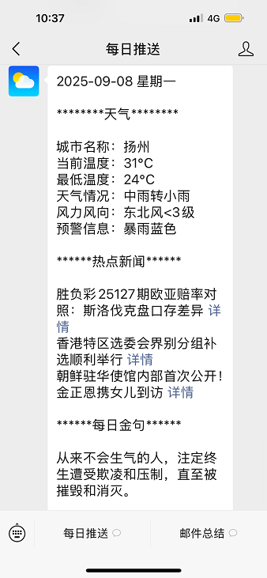

# 企业微信每日消息推送系统

[](https://www.python.org/)
[](LICENSE)

一个基于企业微信的企业级消息推送系统，支持每日天气推送、邮件总结、AI对话等功能。

## ✨ 功能特性

### 🚀 核心功能

- **企业微信消息推送** - 支持文本消息推送和接收
- **每日天气推送** - 自动获取天气信息和预警
- **热点新闻推送** - 实时获取各大新闻平台热点
- **每日金句推送** - 提供 inspirational quotes
- **邮件智能总结** - AI分析邮件内容并生成摘要
- **AI多轮对话** - 基于LangChain的智能对话系统

### 📊 高级特性

- **邮件统计** - 自动统计收发邮件数量（已优化：正确区分收到和发送的邮件）
- **智能过滤** - 过滤自己发的邮件，避免重复分析
- **记忆管理** - 支持多用户对话记忆
- **错误处理** - 完善的异常处理和重试机制（已增强）
- **配置管理** - 基于环境变量的灵活配置
- **性能优化** - 消息去重机制优化，提高处理效率

## 🛠️ 技术栈

### 后端框架

- **Python 3.9+** - 主编程语言
- **Flask** - Web框架，处理企业微信回调
- **LangChain** - AI对话和记忆管理框架

### AI & API

- **OpenAI GPT** - 大语言模型 (兼容OpenAI API)
- **企业微信API** - 企业级消息推送
- **IMAP** - 邮件获取协议

### 数据处理

- **BeautifulSoup4** - HTML解析
- **Requests** - HTTP客户端
- **python-dotenv** - 环境变量管理

### 企业微信集成

- **WXBizMsgCrypt3** - 企业微信消息加解密

## 📋 环境要求

- **Python**: 3.9 或更高版本
- **操作系统**: Windows/Linux/macOS
- **内存**: 至少 512MB
- **磁盘空间**: 至少 100MB

## 🚀 快速开始

### 1. 克隆项目

```bash
git clone https://github.com/blacksamuraiiii/wechat-daily
cd 企业微信每日推送
```

### 2. 安装依赖

```bash
pip install -r requirements.txt
```

### 3. 配置环境变量

```bash
# 复制模板文件
cp .env.template .env

# 编辑配置文件
nano .env  # 或使用其他编辑器
```

### 4. 配置说明

#### 企业微信配置

```env
# 在企业微信管理后台获取
WEIXIN_CORP_ID = "你的企业ID"
WEIXIN_CORP_SECRET = "你的应用Secret"
WEIXIN_AGENT_ID = 1000001  # 你的应用AgentId
WEIXIN_TO_USER = "用户名"  # 或 "@all" 推送给所有人
```

#### AI配置

```env
# 支持任何OpenAI兼容的API
AI_API_KEY = "你的API密钥"
AI_BASE_URL = "https://api.openai.com/v1"
AI_MODEL_NAME = "gpt-4o-mini"
```

#### 邮箱配置

```env
# 用于邮件总结功能
IMAP_SERVER = "imap.163.com"
IMAP_PORT = 993
USER_EMAIL = "your-email@163.com"
PASSWORD = "your-password"
```

### 5. 运行应用

```bash
# 启动Flask服务器
python run.py
```

服务器将在 `http://localhost:1111` 启动。

## 📸 效果展示

### 天气推送功能



### 邮件总结功能


## 📖 使用指南

### 企业微信配置

1. **创建企业微信应用**

   - 登录 [企业微信管理后台](https://work.weixin.qq.com/)
   - 创建新应用，获取 `CorpID`、`Secret`、`AgentId`
2. **配置回调URL**

   - 在应用设置中配置回调URL: `http://your-domain.com/wechat`
   - 填入 `Token` 和 `EncodingAESKey`
3. **设置IP白名单**

   - 添加服务器IP到企业微信白名单

### 功能使用

#### 天气推送

```bash
python src/send_weather_message.py
```

#### 邮件总结

```bash
python src/send_email_summary.py
```

#### AI对话

在企业微信中直接发送消息即可触发AI对话。

#### 消息推送

```bash
# 使用环境变量中配置的用户
python src/send_message.py

# 指定推送用户（命令行参数优先）
python src/send_message.py "HuangWeiShen"
```

### 定时任务设置

可以使用系统定时任务或Python的schedule库设置定时推送：

```python
import schedule
import time

def daily_push():
    # 执行天气推送
    os.system('python send_weather_message.py')
    # 执行邮件总结
    os.system('python send_email_summary.py')

# 每天早上8点推送
schedule.every().day.at("08:00").do(daily_push)

while True:
    schedule.run_pending()
    time.sleep(60)
```

## 🏗️ 项目结构

```
企业微信每日推送/
├── .env                    # 环境变量配置
├── .env.template          # 配置模板
├── requirements.txt       # Python依赖
├── run.py                 # Flask主程序
├── src/                   # 源代码目录
│   ├── send_message.py        # 企业微信消息推送
│   ├── send_weather_message.py # 天气推送模块
│   ├── send_email_summary.py  # 邮件总结模块
│   ├── chat_with_llm.py       # AI对话模块
│   ├── WXBizMsgCrypt.py       # 企业微信加解密
│   └── WXBizMsgCrypt3.py      # 企业微信加解密
├── screenshots/            # 截图目录
│   ├── 微信图片_天气推送.png
│   └── 微信图片_邮件总结.png
└── README.md              # 项目文档
```

## 🔧 配置详解

### 企业微信配置

| 参数                   | 说明           | 获取方式         |
| ---------------------- | -------------- | ---------------- |
| `sToken`             | 应用Token      | 企业微信应用设置 |
| `sEncodingAESKey`    | 消息加解密密钥 | 企业微信应用设置 |
| `WEIXIN_CORP_ID`     | 企业ID         | 企业微信管理后台 |
| `WEIXIN_CORP_SECRET` | 应用Secret     | 企业微信应用设置 |
| `WEIXIN_AGENT_ID`    | 应用AgentId    | 企业微信应用设置 |

### AI配置

| 参数            | 说明       | 默认值                    |
| --------------- | ---------- | ------------------------- |
| `AI_API_KEY`  | API密钥    | 必需                      |
| `AI_BASE_URL` | API基础URL | https://api.openai.com/v1 |
| `AI_MODEL_NAME`    | 模型名称   | gpt-4o-mini               |

### 邮箱配置

| 参数            | 说明       | 示例         |
| --------------- | ---------- | ------------ |
| `IMAP_SERVER` | IMAP服务器 | imap.163.com |
| `IMAP_PORT`   | IMAP端口   | 993          |
| `USER_EMAIL`  | 邮箱地址   | user@163.com |
| `PASSWORD`    | 邮箱密码   | 密码或授权码 |

## 🐛 故障排除

### 常见问题

1. **企业微信推送失败**

   - 检查网络连接
   - 验证企业微信配置是否正确
   - 确认应用权限设置
2. **AI对话无响应**

   - 检查API密钥是否有效
   - 验证API额度是否充足
   - 确认网络能访问AI服务
3. **邮件获取失败**

   - 检查邮箱IMAP设置是否开启
   - 验证邮箱密码/授权码
   - 确认网络连接IMAP服务器

### 日志查看

```bash
# 查看Flask日志
python run.py

# 查看模块执行日志
python send_weather_message.py 2>&1 | tee weather.log
```

## 🤝 贡献指南

1. Fork 本项目
2. 创建特性分支 (`git checkout -b feature/AmazingFeature`)
3. 提交更改 (`git commit -m 'Add some AmazingFeature'`)
4. 推送到分支 (`git push origin feature/AmazingFeature`)
5. 创建 Pull Request

## 📄 许可证

本项目采用 MIT 许可证 - 查看 [LICENSE](LICENSE) 文件了解详情。

## 🙏 致谢

- [企业微信](https://work.weixin.qq.com/) - 企业级通讯平台
- [OpenAI](https://openai.com/) - AI模型提供
- [LangChain](https://langchain.com/) - AI应用框架
- [Flask](https://flask.palletsprojects.com/) - Python Web框架

## 📞 联系方式

如有问题或建议，请通过以下方式联系：

- 邮箱: black_samurai@yeah.net
- 项目Issues: [GitHub Issues](https://github.com/blacksamuraiiii/wechat-daily/issues)

---

**最后更新**: 2025-09-08
